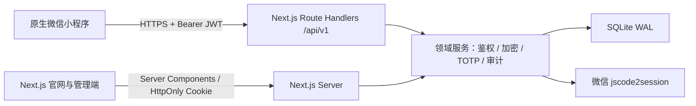

# 技术架构

## 1. 总体结构



`apps/web` 是唯一服务端进程。App Router 同时承载官网、管理端、版本化 API 和数据库访问，避免旧架构中 Python DTO、Vite 类型和小程序字段三方漂移。

## 2. 数据设计

- `users`：微信身份与状态。
- `teams` / `team_members`：池边界和 RBAC。
- `vault_items`：统一内容表。`kind` 区分内容类型，正文采用三个加密字段保存。
- `share_links`：哈希令牌、有效期、最大领取次数。
- `team_invites`：哈希邀请令牌、目标角色与有效期。
- `audit_logs`：只保存动作和目标元数据，不保存内容正文、验证码或密钥。
- `schema_migrations`：幂等数据库迁移版本。

数据库启用 WAL、外键约束和 busy timeout。初始化由服务进程幂等执行，也可以提前运行 `npm run db:init`。

## 3. API 边界

业务接口统一放在 `/api/v1`，响应格式为：

```json
{ "code": 0, "data": {}, "msg": "" }
```

小程序的 `utils/api.js` 在传给页面前解开响应信封，并集中兼容 camelCase。新代码不再继续扩散 snake_case。

## 4. 部署模型

当前 SQLite 驱动要求持久磁盘和长生命周期 Node.js 进程，适合 VPS、Docker、PM2 或支持持久卷的平台。不要将当前配置直接部署到无状态 Serverless。

当出现下列任一条件时迁移 PostgreSQL：

- Next.js 需要水平扩容为多个实例；
- 写入并发持续超过单机 SQLite 的合理范围；
- 需要托管备份、只读副本或跨区域容灾。

迁移时保持 Route Handlers 和领域模型不变，把 `src/server/db.ts` 后面的查询抽到 repository 层并替换驱动。Redis 只在需要分布式限流和短期令牌高吞吐时引入，不作为当前架构的硬依赖。

## 5. 从旧版迁移

旧版 TeamKey 的 FastAPI 数据结构与新版统一内容模型不兼容，且旧密文依赖原 `SERVER_MASTER_KEY`。上线迁移必须在持有旧密钥的可信环境中执行“解密 → 新密钥重加密”，不能直接复制密文字段。仓库不包含业务数据库，因此本次重构没有自动迁移或触碰现有运行数据。
