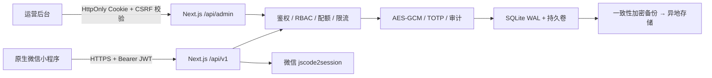

# CodePool 技术架构



## 代码结构

```text
apps/web/       Next.js 官网、运营后台、Route Handlers、SQLite 数据层
apps/miniapp/   微信原生 WXML / WXSS / JavaScript
docs/           产品、架构、安全、API 和上线文档
```

只有一个 Node.js 生产服务。管理页面通过客户端 API 获得加载、错误和实时操作反馈；所有数据
规则仍在服务端执行，页面显隐不作为权限边界。

## 数据模型

- `users`：微信身份、账号状态与 `session_version`。
- `teams` / `team_members`：团队边界、所有权、角色和成员到期。
- `vault_items`：五类内容的统一元数据与 AES-GCM 密文字段。
- `share_links` / `team_invites`：哈希令牌、次数、到期、领取和撤销状态。
- `audit_logs`：不含正文的安全事件。
- `platform_settings`：运营开关、配额和默认有效期。
- `admin_login_attempts` / `api_rate_limits`：持久限流状态。
- `account_deletion_requests`：用户注销工作流。
- `schema_migrations`：按版本追加的生产迁移。

数据库启用 WAL、外键约束和 busy timeout。生产库已经应用 v1；运营治理、限流和注销表位于
追加的 v2，注销申请说明拆分位于追加的 v3。禁止修改历史 migration 假装完成升级。

## 并发与一致性

- 一次性分享使用带条件的 `UPDATE ... RETURNING`，领取次数在事务内原子递增。
- 一次性邀请在事务内条件更新，避免并发重复接受。
- 用户停用和注销通过会话版本使旧 JWT 失效。
- 团队停用会撤销有效分享与邀请；有其他有效成员的活跃团队必须先转移所有权，独有个人团队
  会在注销完成时自动停用归档。
- 所有到期比较使用 SQLite `datetime()` 规范化 ISO 时间。

## 扩容边界

当前模型适合持久磁盘上的单实例 Docker 服务。出现任一情况时应迁移 PostgreSQL：

- 需要水平扩容多个 Next.js 实例；
- 写入并发持续超过单机 SQLite 能力；
- 需要托管 PITR、只读副本或跨区域容灾；
- 限流和后台任务需要分布式一致性。

迁移时将 SQL 查询抽到 repository 层，并把限流迁移到 Redis 或集中式网关；小程序与管理端
API 契约不应改变。
